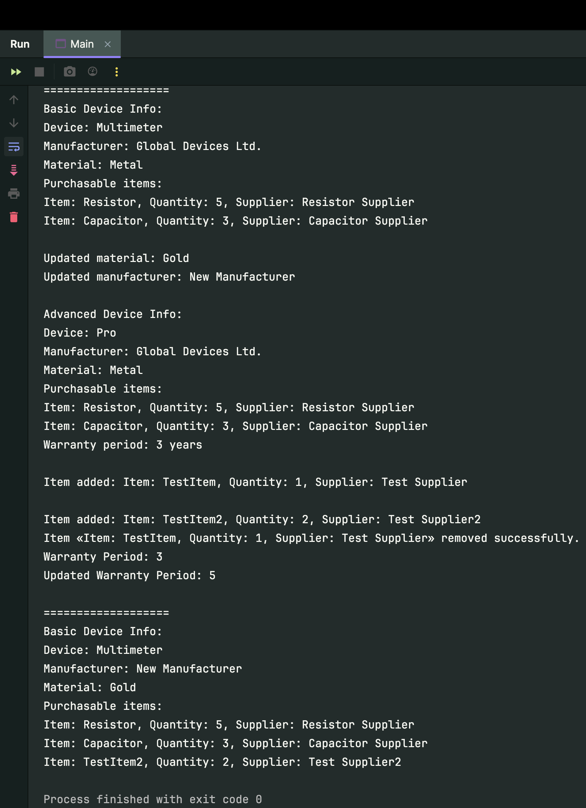

# Лабораторна робота № 4 Застосування конструкції Інтерфейс

## Мета лабораторної роботи –
Придбання навичок в застосуванні конструкції interface в програмамах на мові Java.

## Вхідні дані до лабораторної роботи:
В лабораторній роботі застосовуються результати лабораторної роботи№3. та обробки виняткових ситуацій у програмах на мові Java.

## Виконання лабораторної роботи
Проаналізувати завдання на розробку ієрархії класів (лабораторна робота №3) і виявити, як мінімум 2 методи з кожного класу, які можуть бути об’явлені у інтерфейсах. Запропонувати константу, яка може бути об’явлена у інтерфейсах. Створити ієрархію з двох інтерфейсів. Переробити класи з лабораторної роботи № 3 для реалізації розроблених інтерфейсів.

## Висновок: 
На цій лабораторній роботі, було закріплено навички практичної роботи з класами на мові Java. Придбано навички використання спадкування, віртуальних функцій, статичних даних і функцій при написанні програм на мові Java. У відповідності з завданням стоврено cтворtyj ієрархію з трьох класів (Абстрактний ←Клас1←Клас2).
Характеристики приладу з таблиці 1 реалізуються в перших двох класах. Характеристики приладу з таблиці 2 реалізуються в класі Класс2.
Визначено та додано статичні дані та відповідні статичні методи.
Визначено одну віртуальну функцію displayDeviceInfo в Абстрактному класі.
Реалізувано віртуальну функції в класі Класс1 і перевизначено в класі Класс2.
Продемонструвано роботу з об'єктами різних класів і використання віртуальної функції.


**З таким вмістом в Main:**
```java
import java.util.ArrayList;

public class Main {
   public static void main(String[] args) {
      ArrayList<PurchasableItem> itemsList = new ArrayList<>();
      itemsList.add(new PurchasableItem("Resistor", 5, "Resistor Supplier"));
      itemsList.add(new PurchasableItem("Capacitor", 3, "Capacitor Supplier"));

      DeviceManagement device1 = new MeasuringDevice("Multimeter", itemsList);

      System.out.println("===================\nBasic Device Info:");
      device1.displayDeviceInfo();

      device1.setMaterial("Gold");
      device1.setManufacturer("New Manufacturer");
      System.out.println("\nUpdated material: " + device1.getMaterial());
      System.out.println("Updated manufacturer: " + device1.getManufacturer());

      AdvancedDeviceFeatures advancedDevice = new AdvancedMeasuringDevice("Pro", itemsList, 3);
      System.out.println("\nAdvanced Device Info:");
      advancedDevice.displayDeviceInfo();

      PurchasableItem newItem = new PurchasableItem("TestItem", 1, "Test Supplier");
      PurchasableItem newItem2 = new PurchasableItem("TestItem2", 2, "Test Supplier2");

      advancedDevice.addNewItem(newItem);
      advancedDevice.addNewItem(newItem2);
      advancedDevice.removeItem(newItem);

      System.out.println("\nWarranty Period: " + advancedDevice.getWarrantyPeriod());
      advancedDevice.setWarrantyPeriod(5);
      System.out.println("Updated Warranty Period: " + advancedDevice.getWarrantyPeriod());

      System.out.println("\n===================\nBasic Device Info:");
      device1.displayDeviceInfo();
   }
}

```

**Результат:**

